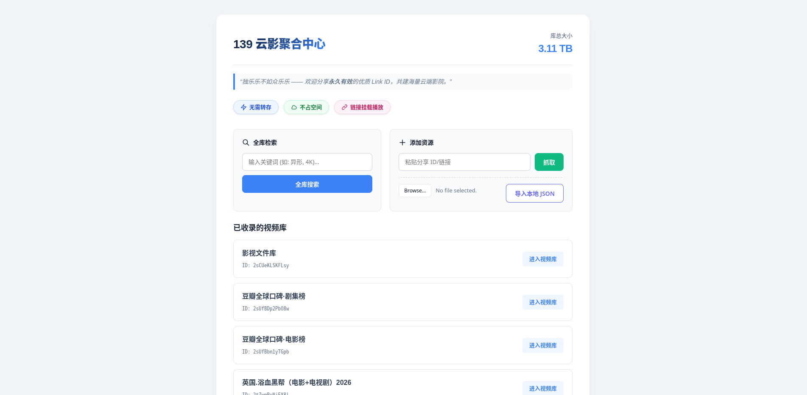
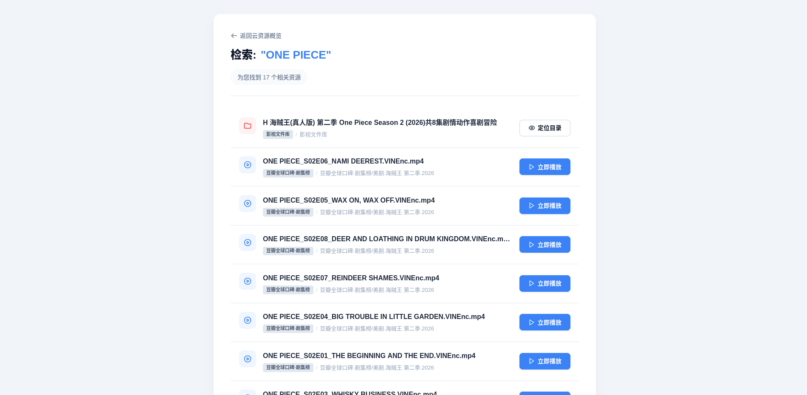

# CloudHub-139 (139 云影聚合中心)

这是一个专门为中国移动 139 云盘打造的资源解析与播放工具。它不仅解决了 139 云盘 M3U8 播放列表在第三方播放器中因相对路径和鉴权导致的失败问题，还提供了一个美观、强大的 Web 管理界面。

## 🎬 项目演示

### 1. 主页概览与资源管理

*简洁直观的仪表盘，支持实时日志监控与资源状态展示。*

### 2. 全库精准搜索

*跨分享库的全局搜索，支持关键词匹配与文件夹定位。*

### 3. 沉浸式播放界面

*集成 HLS.js 的在线播放器，支持 1080P 高清解析与无缝预览。*

### 4. 核心功能演示

*全自动抓取、解析并开始 HLS 播放的全过程。*

### 5. 极速播放体验

*流畅的在线播放体验，支持重写 HLS 鉴权链接。*

## 🌟 核心功能

- **全库搜索引擎**：跨分享链接的全局搜索，支持关键词检索文件及文件夹，并可一键定位并高亮显示目标。
- **M3U8 重写引擎**：自动将相对路径转换为带签名的绝对路径 URL，确保 HLS 视频可全局播放。
- **Web 可视化仪表盘**：内置 Flask Web 服务器，提供资源概览、库总大小计算、文件夹深度导航及在线播放功能。
- **生产级稳定性**：内置 **Waitress** WSGI 服务器，支持生产环境稳定运行。
- **命令行控制**：支持丰富的启动参数，动态调整端口、地址及抓取频率。
- **智能抓取与断点保护**：支持多级目录深度递归抓取，并实现增量保存，防止大批量任务中途失败。
- **本地 JSON 导入/导出**：支持通过 Web 界面直接上传 `fetched_results.json`，实现资源元数据的快速迁移与共享。
- **实时日志终端**：基于 SSE 技术，在 Web 页面实时展示抓取进度及后台日志，状态一目了然。

## 🛠️ 环境要求

- Python 3.8+
- 官方安装：
  ```bash
  pip install cloudhub-139
  ```

## 🚀 快速开始

### 1. 配置环境

在项目根目录下创建 `.env` 文件，并填写账号信息（也可在启动时通过参数传入）：

```env
YUN_ACCOUNT="你的手机号"
YUN_AUTH_TOKEN="你的授权令牌"
```

### 2. 启动服务

安装后直接运行 `cloudhub-139` 即可开启生产级服务：

```bash
cloudhub-139
```

## 🎁 社区资源共享

为了让您快速体验，本项目提供了一个精心整理的影视库初始包（包含热门 4K 资源索引）。

1. **获取资源包**：下载仓库中的 [assets/139.zip](assets/139.zip)。
2. **一键导入**：
   ```bash
   cloudhub-139 --import-lib assets/139.zip
   ```
*导入完成后重新启动服务，即可直接在主页看到海量影视库并进行全局搜索。*

## ⚙️ 高级启动参数

支持通过命令行参数灵活配置：

| 参数 | 说明 | 默认值 |
| --- | --- | --- |
| `--port` | 监听端口 | `5000` |
| `--host` | 监听地址 | `0.0.0.0` |
| `--interval` | 抓取请求间隔(秒) | `2.0` |
| `--account` | 手机账号 | 从 `.env` 读取 |
| `--token` | 鉴权 Token | 从 `.env` 读取 |
| `--full-scan` | 保留全量原始数据 | `False` |
| `--export` | 导出库数据为压缩包 | - |
| `--import-lib` | 从压缩包导入/合并库 | - |
| `--debug` | 开启调试模式 | `False` |

**示例：**
```bash
cloudhub-139 --port 8080 --interval 3.5 --debug
```

## 📂 项目结构

- `pyproject.toml`: PyPI 打包配置文件。
- `src/cloudhub/`: 源代码包。
  - `app.py`: Flask 路由、抓取逻辑、搜索引擎与启动入口。
  - `client.py`: 139 云盘 API 封装。
  - `crypto.py`: AES 加解密核心实现。
- `links.json`: 存储所有分享链接及其元数据。
- `data/`: 存放抓取后的目录结构缓存（JSON）。
- `assets/`: README 资源。

## 📝 技术亮点

项目核心在于 `rewriteM3U8` 逻辑与高效的递归抓取。通过实时拦截并注入最新的鉴权签名，解决了 139 云盘 HLS 切片地址失效的问题。同时，系统内置了 **Waitress** 生产级服务器、请求频率限制与增量写盘策略，确保了系统在处理超大资源库时的稳定性和可靠性。

---
*Created with ❤️ for 139 Cloud Integration.*
